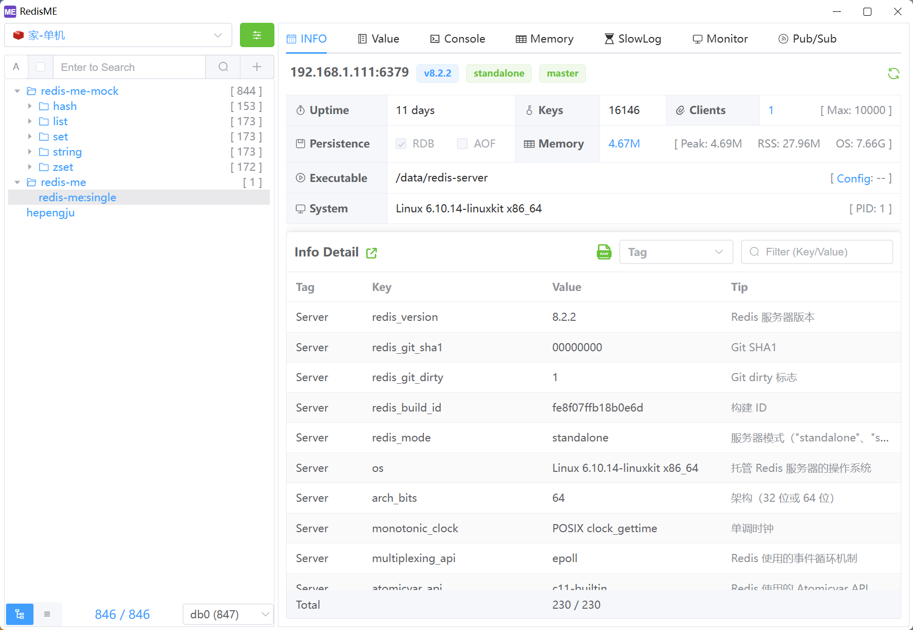
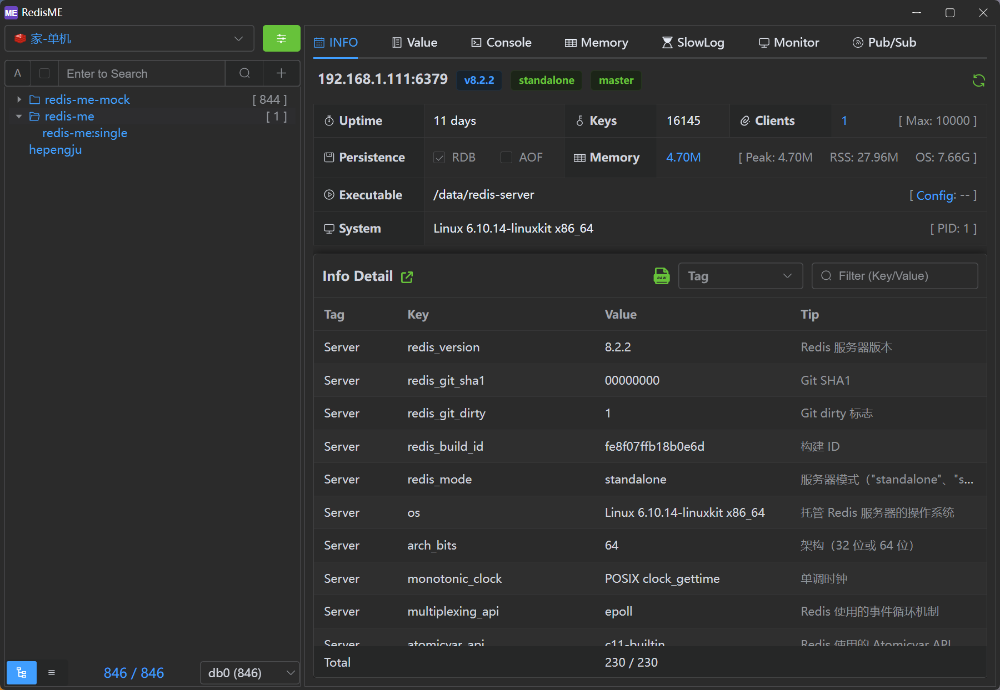

<h1 align="center">RedisME</h1>
<h4 align="center"><strong>English</strong> | <a href="https://github.com/hepengju/redis-me/blob/master/README_zh.md">
简体中文</a> 
</h4>

<strong>RedisME is a modern lightweight cross-platform Redis desktop manager </strong>

