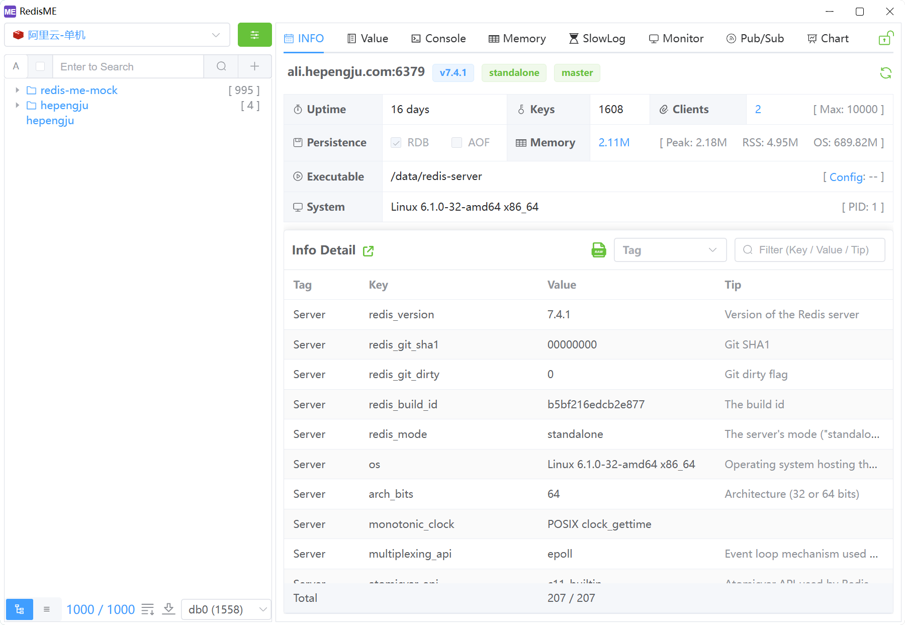
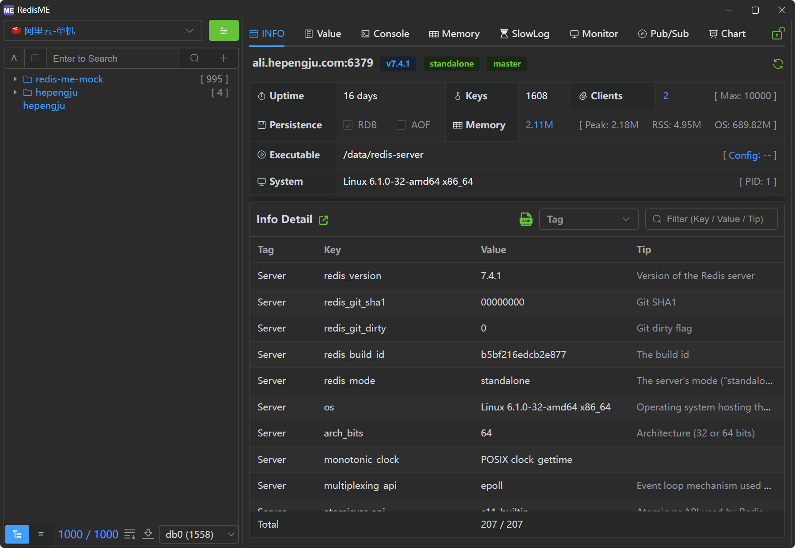

<div align="center">
<a href="https://github.com/hepengju/redis-me/"></a>
</div>
<h1 align="center">RedisME</h1>
<h4 align="center"><strong>English</strong> | <a href="/README_zh.md">
简体中文</a> 
</h4>
<div align="center">

[](https://github.com/hepengju/redis-me/blob/main/LICENSE)
[](https://github.com/hepengju/redis-me/releases)


<strong>RedisME is a modern lightweight cross-platform Redis desktop manager </strong>
</div>




## Features

- Super Lightweight: Based on Webview2, no embedded browser (Thanks to [Tauri](https://tauri.app))
- Pretty UI: Provides light/dark themes(Thanks to [ElementPlus](https://element-plus.org))
- Multi-language support: English, Chinese, more languages coming soon
- Rich functionality: info, value, terminal, memory analysis, slow logs, command monitoring, pub/sub etc
- Special features:
    * Read-only writable mode real-time conversion
    * Highlighting and detailed explanations of info fields
    * Configuration field comparison, detailed explanations, and default value references
    * Fine-grained memory scan parameter configuration for quick memory issue troubleshooting
    * Terminal command execution with automatic broadcasting to multiple nodes in a cluster
    * Cluster operations can specify nodes

## Installation

Available to download for free from [here](https://github.com/hepengju/redis-me/releases)

## Build Guidelines

```shell
# System Prerequisites: Refer Tauri  https://tauri.app/start/prerequisites/
# Windows: Microsoft C++
# Mac: Xcode
# Linux: libwebkit2gtk, build-essential etc

# rust
curl --proto '=https' --tlsv1.2 -sSf https://sh.rustup.rs | sh

# node (fnm)
curl -o- https://fnm.vercel.app/install | bash
fnm install 22

# pnpm
npm install -g pnpm

# clone
git clone https://github.com/hepengju/redis-me.git --depth=1

# install package.json and start dev
pnpm install
pnpm tauri dev

# If SSL compilation fails, you can refer to, refer: https://aws.github.io/aws-lc-rs/index.html 
```
