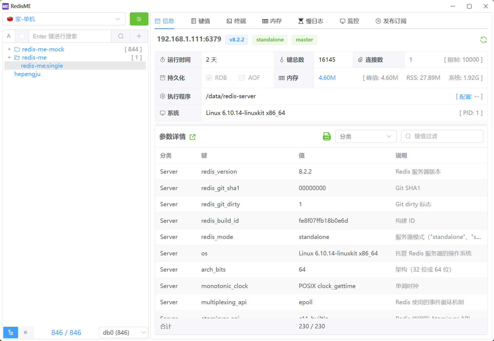
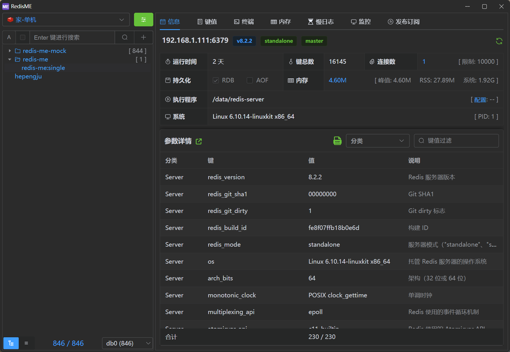

<div align="center">
<a href="https://github.com/hepengju/redis-me/"></a>
</div>
<h1 align="center">RedisME</h1>
<h4 align="center"><strong><a href="/README.md">English</a></strong> | 简体中文 </h4>
<div align="center">

[](https://github.com/hepengju/redis-me/blob/main/LICENSE)
[](https://github.com/hepengju/redis-me/releases)


<strong>一个现代、轻量、跨平台的Redis桌面客户端</strong>
</div>




## 功能特性
- 极度轻量：基于Webview2，无内嵌浏览器，安装包小于10M（感谢 [Tauri](https://tauri.app/zh-cn)）
- 界面美观：提供浅色/深色主题（感谢 [ElementPlus](https://cn.element-plus.org/zh-CN/)）
- 多语言支持：英文、中文，敬请期待其他语言
- 功能丰富：支持信息、键值、终端、内存分析、慢日志、命令监控、发布订阅等
- 特色功能：
  * 信息字段的重点标记和详细解释
  * 配置字段的差异比对、详细解释、默认值参考
  * 精细化的内存扫描参数配置，快速排查内存问题
  * 终端执行命令，支持自动广播到集群的多节点
  * 集群操作可指定节点

## 应用安装
提供Mac、Windows和Linux安装包，可免费下载 [Github](https://github.com/hepengju/redis-me/releases)、[Gitee](https://gitee.com/hepengju/redis-me/releases)

## 构建项目
```shell
# 系统前置依赖: Tauri说明 https://tauri.app/zh-cn/start/prerequisites/#rust
# Windows: Microsoft C++
# Mac: Xcode
# Linux: libwebkit2gtk, build-essential 等

# 安装 Rust （国内镜像 https://rsproxy.cn/）
curl --proto '=https' --tlsv1.2 -sSf https://sh.rustup.rs | sh

# 安装Node（推荐使用fnm安装）
curl -o- https://fnm.vercel.app/install | bash
fnm install 22

# 安装pnpm （国内镜像 https://npmmirror.com/）
npm install -g pnpm

# 克隆项目
git clone https://github.com/hepengju/redis-me.git --depth=1

# 安装前端依赖，然后本地启动开发模式
pnpm install
pnpm tauri dev

# 如果SSL编译失败, 可参考: https://aws.github.io/aws-lc-rs/index.html 添加必要组件
```
