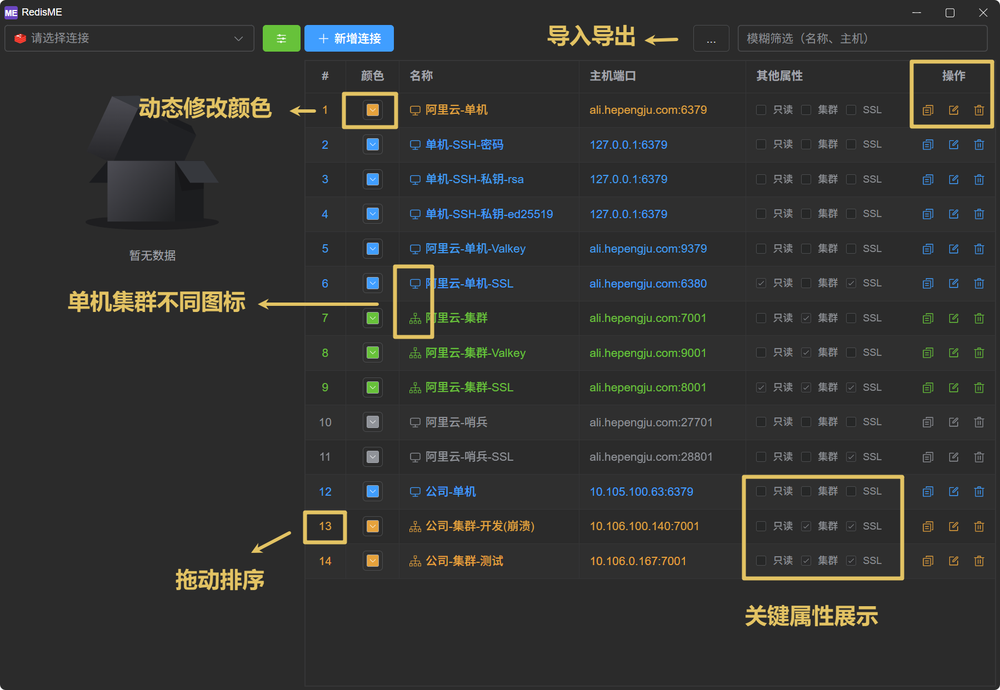
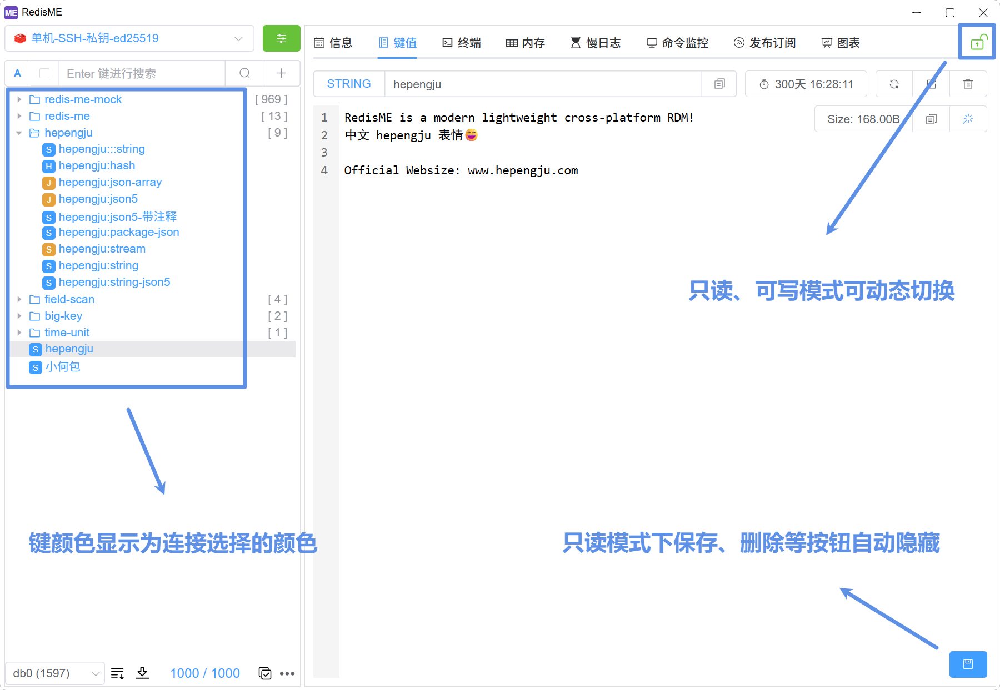
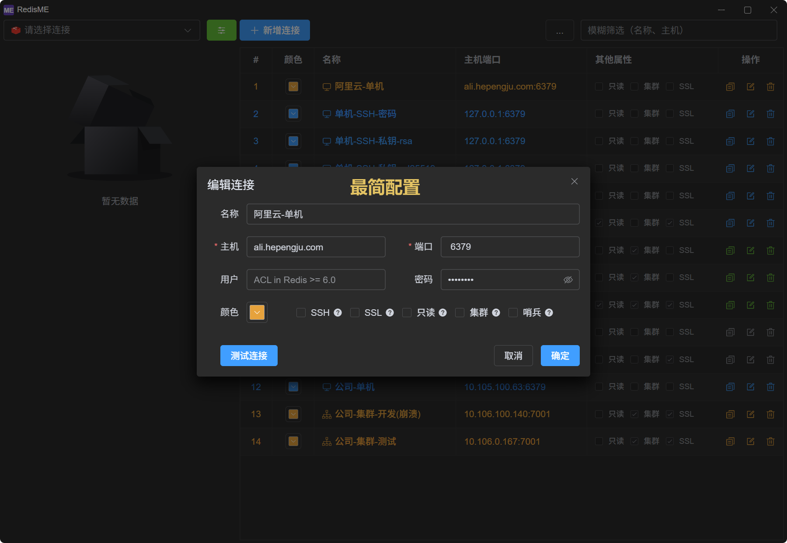
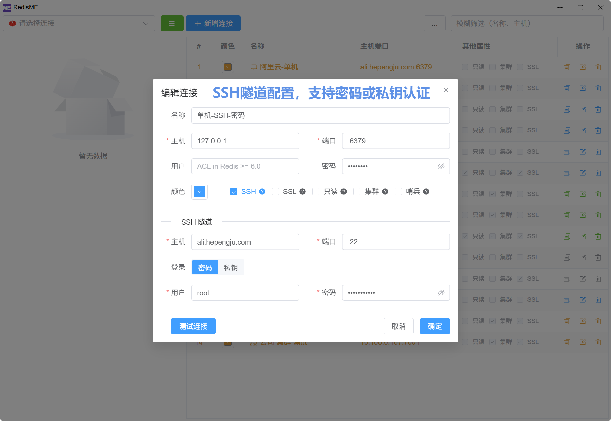
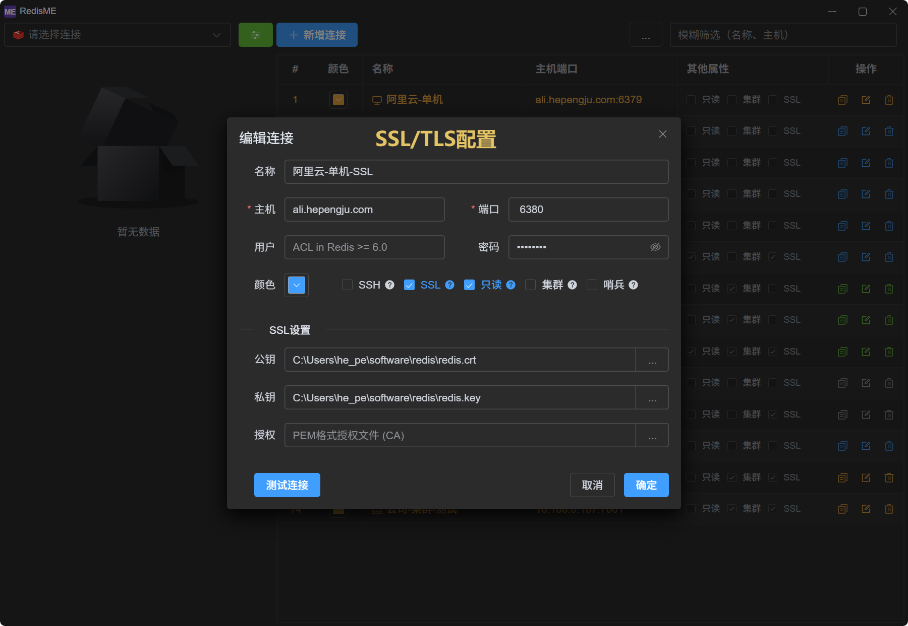
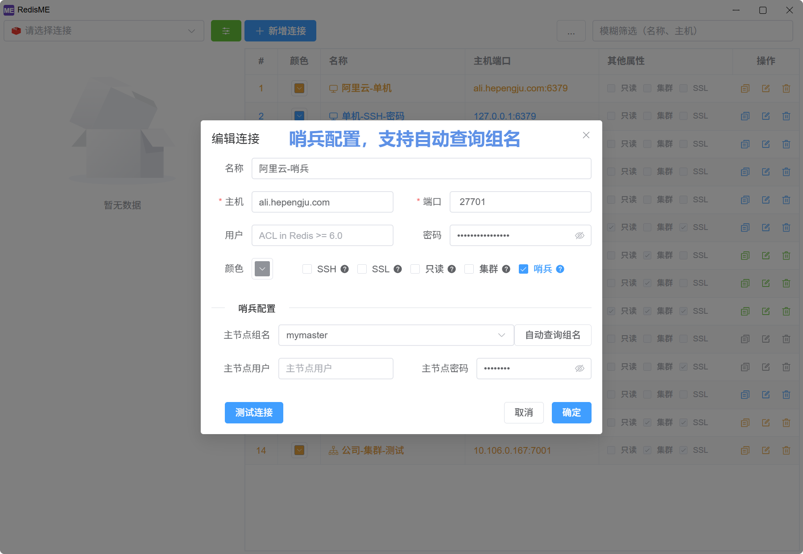

# Connection

The connection management in [RedisME](https://www.hepengju.com) is simple and elegant.

## Overview

- **Connection List**: Fuzzy filtering, **color customization**, key property display, drag-to-reorder, copy connections, etc.
- **Export/Import**: Export existing connections to a JSON file and import connections from a JSON file
- **Add Connection**: Supports SSH, SSL, read-only mode, cluster, sentinel, and other configurations with connection testing
  - **SSH**: SSH tunnel mode is suitable when the Redis server is on an intranet and cannot be accessed directly, requiring a jump server
  - **SSL**: Use when the Redis server has TLS/SSL enabled; client certificate and private key may be required
  - **Cluster**: Simply fill in the address of any node, and all nodes in the cluster will be automatically identified
  - **Sentinel**: Choose any sentinel, and fill in the sentinel's address, port, and password according to the sentinel configuration
  - **Read-only**: All edit, delete, and write buttons are hidden. You can **dynamically switch between read-only and read-write modes** via the lock icon

