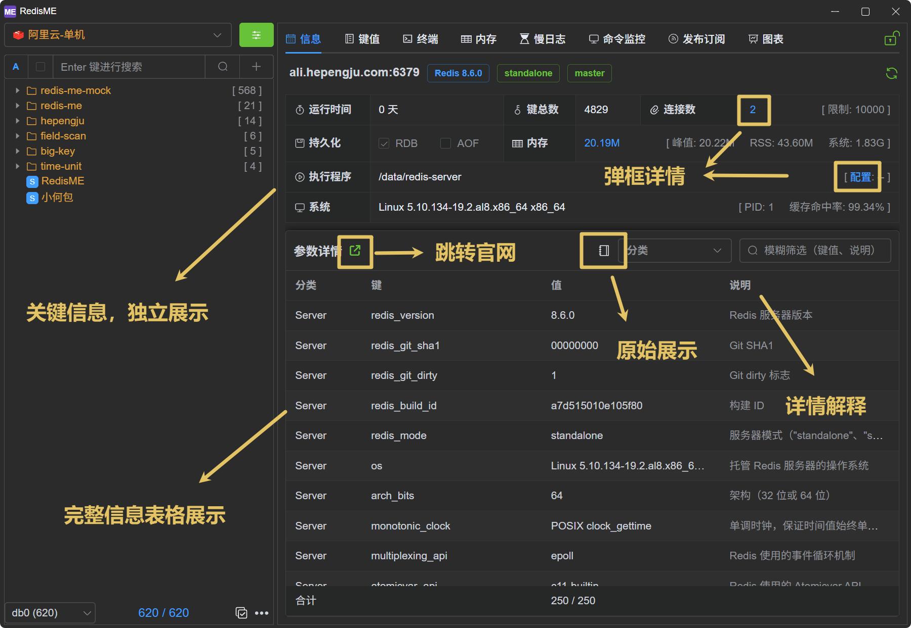
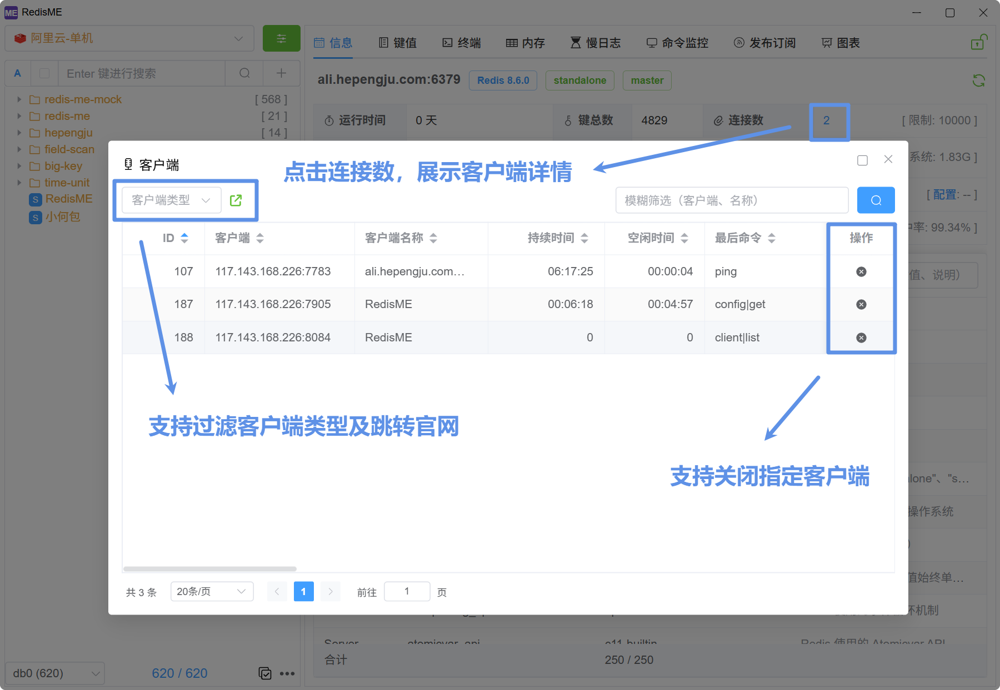
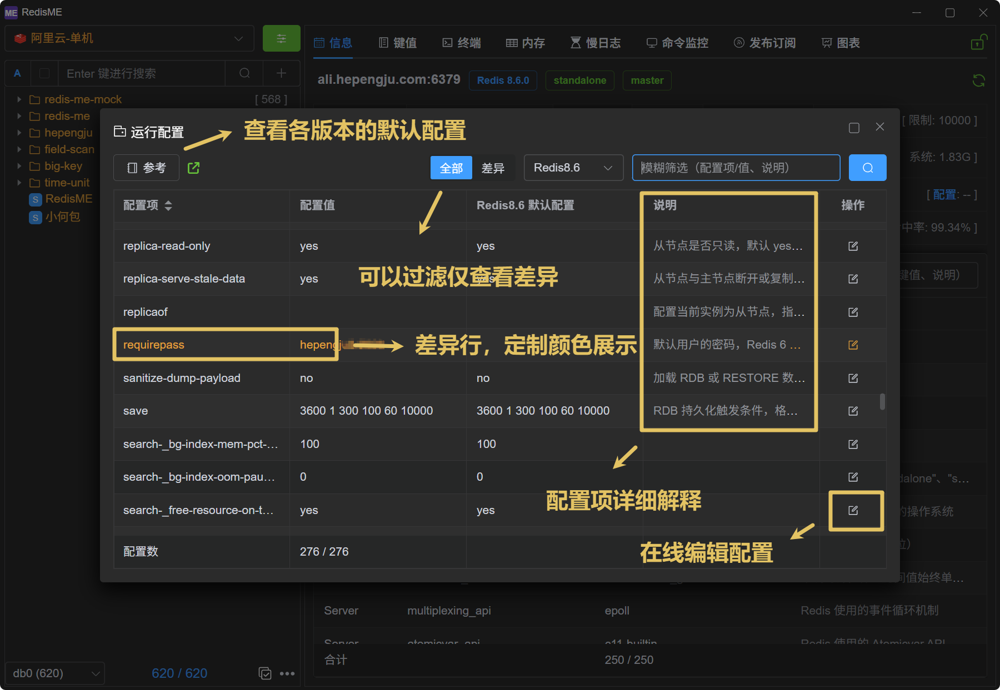
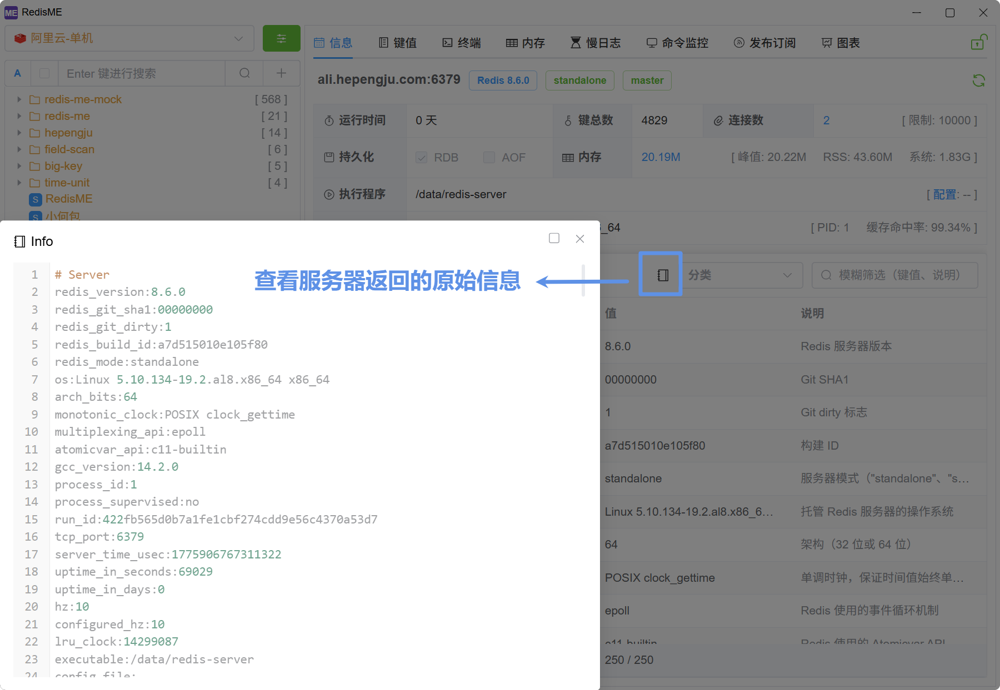
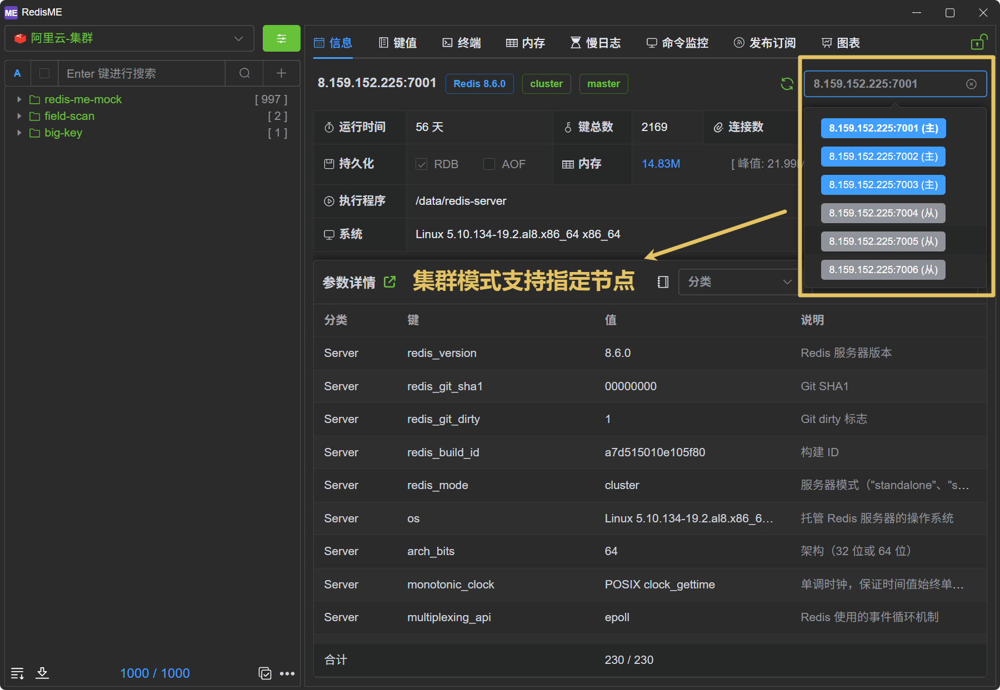

# Info

The info page (`info`) in [RedisME](https://www.hepengju.com) is the default tab when entering a connection, displaying key server information at a glance.

## Overview

- **Key Highlights**: Version, mode, role, uptime, and other important metrics are prominently displayed with **view details** support
- **Client Details**: Click on the connection count to open a modal showing client details (`client list`), with support for closing specific connections
- **Config Modal**: Click on configuration to show config details (`config get`)
  - Supports **comparison with default values** (across versions) and filtering, with differences highlighted in color
  - Supports viewing the official default configuration file for customized configuration
  - Provides detailed explanations for configuration items
  - **Supports editing configuration directly in the UI**
- **Memory Navigation**: Click to jump to the memory analysis tab to find large keys (`memory usage`)
- **Categorized Display**: Information is displayed in tables grouped by module, **with detailed explanations for each key**
- **Raw Info**: Click the book icon to view the raw info output
- **Specify Node**: In cluster mode, supports fetching **info for specific nodes**

