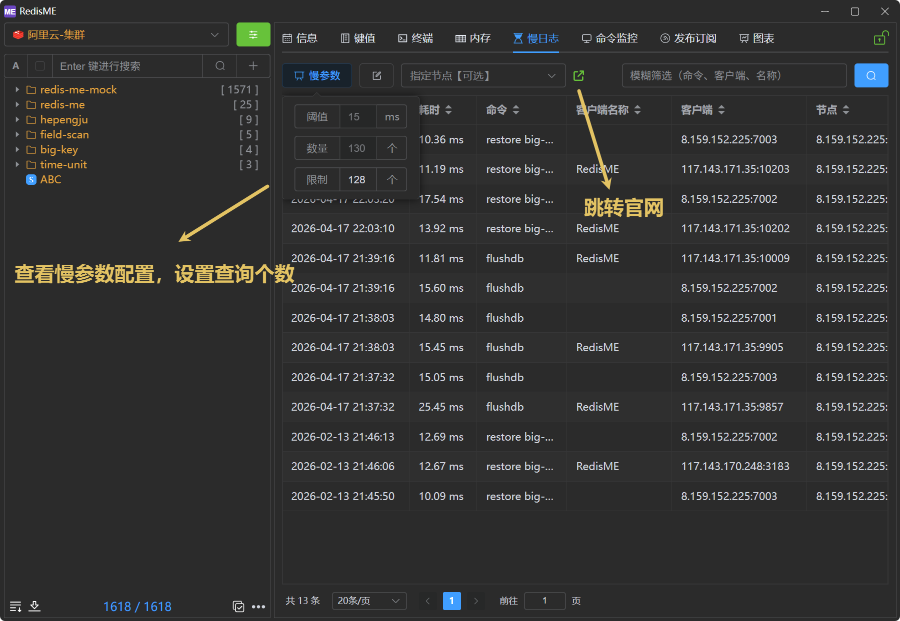
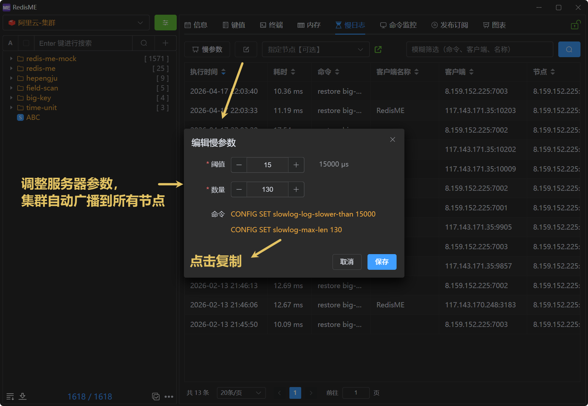

# SlowLog

The slowlog feature in [RedisME](https://www.hepengju.com) is built on Redis `SLOWLOG GET`, which helps you troubleshoot issues.

## Feature overview

- **SlowLog show**: View the slowlog list with fuzzy filtering, column sorting, and a configurable maximum number of entries to fetch.
- **SlowLog config**: View slowlog settings and edit the server's slow log parameters (for clusters, changes are broadcast to all nodes automatically).

