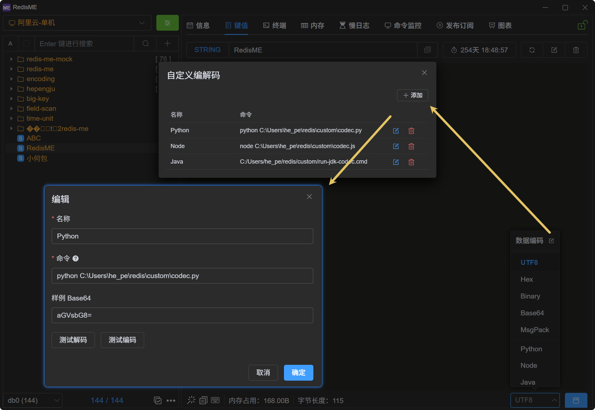
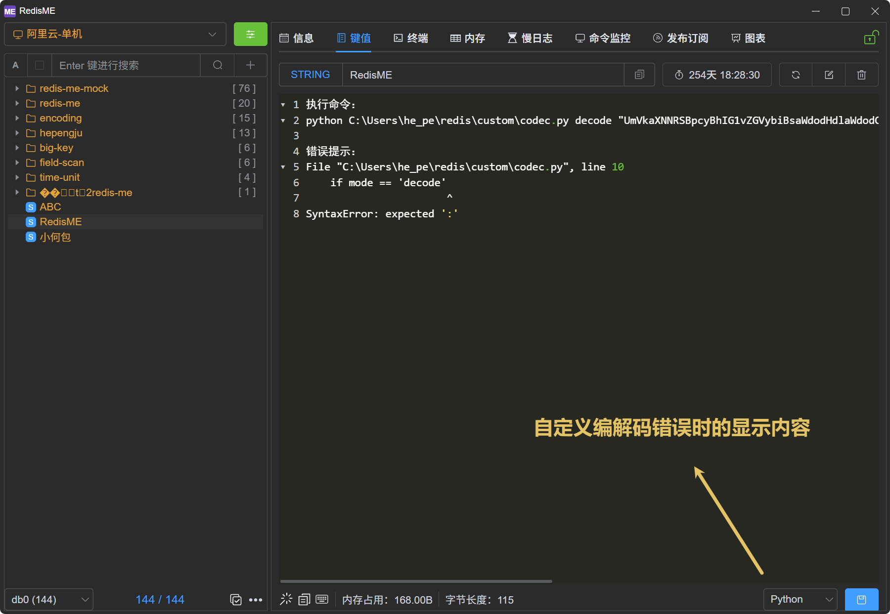

# 自定义编解码

[RedisME](https://www.hepengju.com) 支持通过外部脚本自定义序列化/反序列化，便于查看与编辑非 UTF-8 或业务自定义格式的数据。

## 入口与配置

1. 打开值详情页
2. 在 **数据编码** 下拉框右侧点击 **编辑** 图标，打开「自定义编解码」对话框
3. 添加一项：
   - **名称**：显示在下拉列表中
   - **命令**：含解释器的完整可执行命令（见下文）



## 脚本协议

应用会在你配置的命令后**自动追加两个参数**：

```bash
# 读：Redis 原始字节（wire base64）→ 编辑器展示文本
{command} decode {wire_base64}

# 写：编辑器文本 → Redis 原始字节（wire base64）
{command} encode {editor_text_utf8_base64}
```

| 方向       | 参数 1   | 参数 2                         | stdout                         |
| ---------- | -------- | ------------------------------ | ------------------------------ |
| **decode** | `decode` | Redis 原始字节的 Base64        | UTF-8 文本（写入编辑器）       |
| **encode** | `encode` | 编辑区文本的 UTF-8 字节 Base64 | **单行** Redis 原始字节 Base64 |

约定：

- 参数 2 为标准 Base64 单行字符串（无空格），脚本用 `sys.argv[2]`（Python）、`args[1]`（Java）或 `process.argv[3]`（Node，因 `argv[1]` 为脚本路径）读取即可
- **decode** 成功：stdout 输出可编辑文本；**encode** 成功：stdout 仅一行 Base64
- 失败：stderr 输出错误信息，非 0 退出码；应用会在错误提示中附上实际执行的完整命令
- 参数 2 的 Base64 是应用与脚本之间的**传输格式**，不等于编辑器里要展示的格式（如下文 Hex 示例）

## 命令配置示例

```
python C:\path\to\codec.py
node /path/to/codec.js
java C:\path\to\codec.java
```

::: tip stdout 编码
应用按 **UTF-8** 读取脚本 stdout。Windows 上 Python 建议在脚本内设置 `sys.stdout.reconfigure(encoding='utf-8')`（见下方示例）。
:::

## 使用流程

1. 配置好自定义编解码并保存
2. 在 **数据编码** 下拉中选择你的自定义项
3. 值区显示 decode 后的文本，编辑后点击 **保存**
4. 可在配置对话框中用 **测试解码 / 测试编码** 验证脚本：
   - 样例 wire Base64 默认 `aGVsbG8=`（即字节 `hello`）
   - 使用下方 Hex 示例时：**测试解码** 应得到 `68656c6c6f`；**测试编码** 可将编辑区样例设为 `68656c6c6f`（UTF-8 文本），应得到 `aGVsbG8=`

## 适用范围与限制

- 单次执行默认超时 5 秒
- 超大值可能受命令行长度限制

## 示例：Python（Hex 查看/编辑二进制）

Redis 原始字节在编辑器中以**小写十六进制**展示；保存时把 Hex 解析回字节写回。

```python
import sys
import base64
import binascii

# Windows 管道输出默认可能是 GBK，RedisME 按 UTF-8 读取
if hasattr(sys.stdout, 'reconfigure'):
    sys.stdout.reconfigure(encoding='utf-8')
    sys.stderr.reconfigure(encoding='utf-8')

mode, b64 = sys.argv[1], sys.argv[2]
try:
    if mode == 'decode':
        print(binascii.hexlify(base64.b64decode(b64)).decode('ascii'))
    elif mode == 'encode':
        hex_str = base64.b64decode(b64).decode('utf-8').strip()
        print(base64.b64encode(binascii.unhexlify(hex_str)).decode('ascii'))
    else:
        raise ValueError(f'unknown mode: {mode}')
except (binascii.Error, ValueError) as e:
    print(str(e), file=sys.stderr)
    sys.exit(1)
```

配置命令示例：

```
C:\path\to\python.exe C:\path\to\codec.py
```

## 示例：Node.js（Hex 查看/编辑二进制）

```javascript
#!/usr/bin/env node
/** wire base64 ↔ 十六进制文本（与 codec.py 协议一致） */
const mode = process.argv[2]
const b64 = process.argv[3]

try {
  if (mode === 'decode') {
    process.stdout.write(Buffer.from(b64, 'base64').toString('hex'))
  } else if (mode === 'encode') {
    const hex = Buffer.from(b64, 'base64').toString('utf8').trim()
    process.stdout.write(Buffer.from(hex, 'hex').toString('base64'))
  } else {
    throw new Error(`unknown mode: ${mode}`)
  }
} catch (e) {
  process.stderr.write(String(e) + '\n')
  process.exit(1)
}
```

配置命令示例：

```
node C:\path\to\codec.js
```

## 示例：Java（Hex 查看/编辑二进制）

需 **JDK 11+**，可直接运行单文件源码（无需先 `javac`）。`args[0]` 为模式，`args[1]` 为 Base64 参数。

```java
import java.nio.charset.StandardCharsets;
import java.util.Base64;

/** wire base64 ↔ 十六进制文本（与 codec.py 协议一致） */
public class codec {
    public static void main(String[] args) {
        if (args.length < 2) {
            System.err.println("usage: codec <decode|encode> <base64>");
            System.exit(1);
        }
        String mode = args[0];
        String b64 = args[1];
        try {
            if ("decode".equals(mode)) {
                System.out.print(toHex(Base64.getDecoder().decode(b64)));
            } else if ("encode".equals(mode)) {
                String hex = new String(Base64.getDecoder().decode(b64), StandardCharsets.UTF_8).trim();
                System.out.print(Base64.getEncoder().encodeToString(fromHex(hex)));
            } else {
                throw new IllegalArgumentException("unknown mode: " + mode);
            }
        } catch (Exception e) {
            System.err.println(e.getMessage());
            System.exit(1);
        }
    }

    private static String toHex(byte[] bytes) {
        StringBuilder sb = new StringBuilder(bytes.length * 2);
        for (byte b : bytes) {
            sb.append(String.format("%02x", b));
        }
        return sb.toString();
    }

    private static byte[] fromHex(String hex) {
        if (hex.length() % 2 != 0) {
            throw new IllegalArgumentException("invalid hex length");
        }
        byte[] out = new byte[hex.length() / 2];
        for (int i = 0; i < hex.length(); i += 2) {
            int hi = Character.digit(hex.charAt(i), 16);
            int lo = Character.digit(hex.charAt(i + 1), 16);
            if (hi < 0 || lo < 0) {
                throw new IllegalArgumentException("invalid hex character");
            }
            out[i / 2] = (byte) ((hi << 4) + lo);
        }
        return out;
    }
}
```

配置命令示例（**须用脚本绝对路径**，勿写 `java codec.java`，否则工作目录不对时 Java 会以 GBK 输出错误，应用读 stdout 会报 `invalid utf-8 sequence`）：

```
java C:\Users\he_pe\redis\custom\codec.java
```

若 PATH 中无 `java`，改用 JDK 的完整路径，例如：

```
"C:\Program Files\Java\jdk-21\bin\java.exe" C:\Users\he_pe\redis\custom\codec.java
```

## 故障排查

| 现象                     | 常见原因                                                                                                                       |
| ------------------------ | ------------------------------------------------------------------------------------------------------------------------------ |
| `invalid utf-8 sequence` | 脚本 stdout 非 UTF-8（Windows 中文输出）；Java 常见原因：**命令里用了相对路径** `codec.java`，找不到文件时 JVM 以 GBK 打印错误 |
| 找不到 python / java     | PATH 无解释器 → 改用 **完整路径**                                                                                              |
| 解码结果为空             | 脚本 decode 未向 stdout 输出，或退出码非 0                                                                                     |
| encode 报 hex 相关错误   | 编辑区含非十六进制字符或长度为奇数                                                                                             |

错误提示中会包含 **执行命令** 一行，可复制到终端对照调试。


