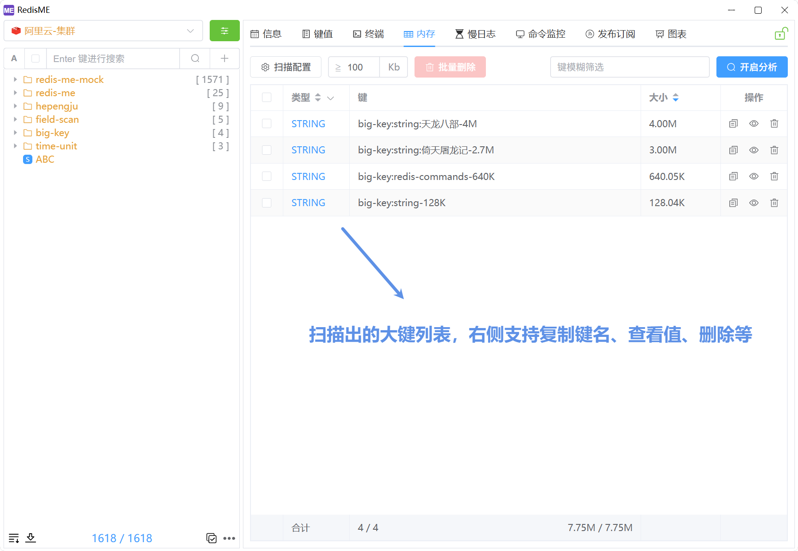
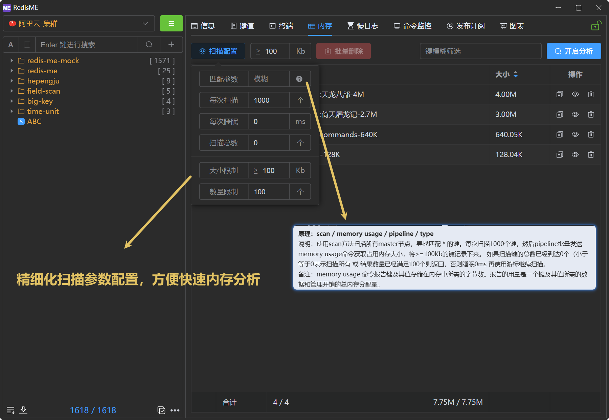
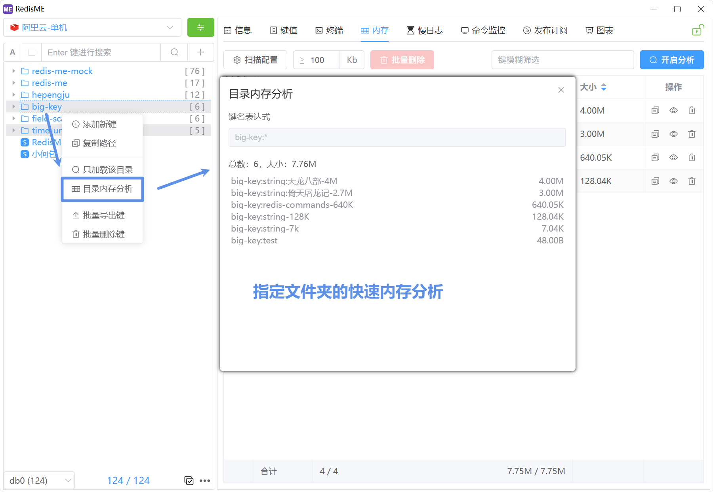

# 内存分析

RedisME 的内存分析基于Redis的`memory usage`命令实现，方便寻找大键。

## 功能简述

- 大键查询: 分析满足条件的键，显示键类型、名称、大小等信息，支持模糊匹配
- 大键操作: 复制键名称，查看值，删除键，多选批量删除键
- 参数配置: 支持精细化配置每次扫描数量、扫描睡眠时间、扫描总数等参数
- 文件夹快速内存分析：右键点击左侧键的文件夹，快速分析其内部键的内存使用情况

