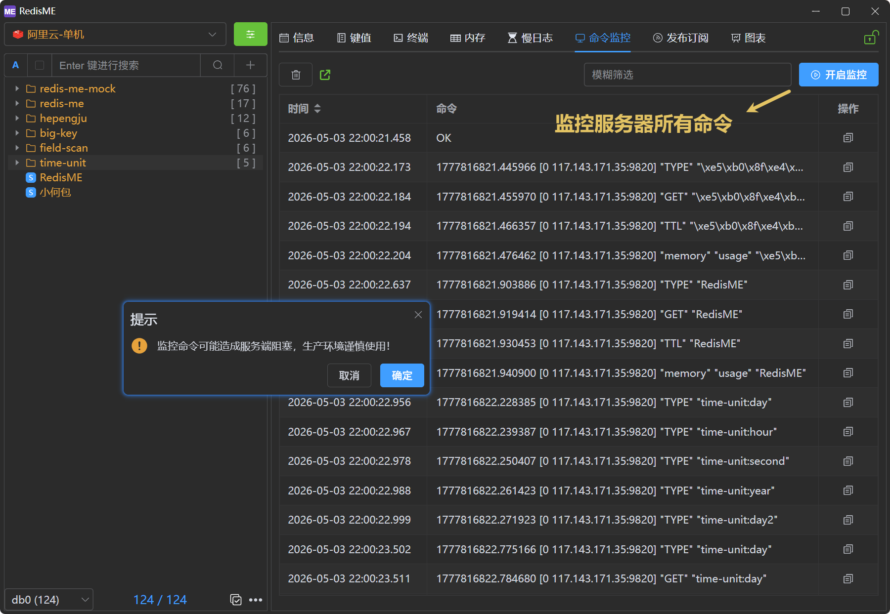

# 命令监控

[RedisME](https://www.hepengju.com) 的命令监控基于Redis的`MONITOR`命令实现，方便排查问题。

> MONITOR 是一个调试命令，它会流式返回 Redis 服务器处理的每个命令。这有助于理解数据库正在发生什么。
> 查看服务器处理的所有请求的能力对于在使用 Redis 作为数据库或分布式缓存系统时发现应用程序中的错误非常有用。
> 出于安全考虑，MONITOR 的输出不会记录任何管理命令，并且在命令 AUTH 中敏感数据会被编辑。
> 因为 MONITOR 会流式返回所有命令，所以它的使用是有代价的。在特定情况下，运行单个 MONITOR 客户端可以将吞吐量降低 50% 以上。运行更多 MONITOR 客户端会进一步降低吞吐量。

