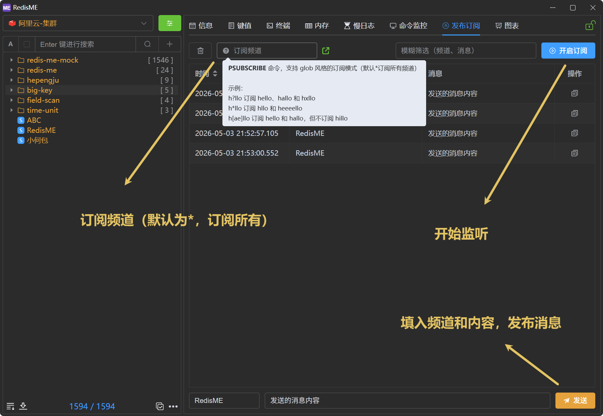

# 发布订阅

[RedisME](https://www.hepengju.com) 的发布订阅基于Redis的`PSUBSCRIBE`、`PUBLISH`命令实现，方便的管理消息发布与订阅。

> SUBSCRIBE、UNSUBSCRIBE 和 PUBLISH 实现了发布/订阅消息模式，其中（引用维基百科）发送者（发布者）无需知道特定的接收者（订阅者）是谁即可发送消息。相反，发布的消息会被归入不同的通道，而无需知道是否存在（或有哪些）订阅者。订阅者表达对一个或多个通道的兴趣，只接收他们感兴趣的消息，而无需知道是否存在（或有哪些）发布者。发布者和订阅者之间的这种解耦实现了更高的可伸缩性和更动态的网络拓扑。

## 功能简述

- 订阅功能: 支持设置订阅频道（glob 风格的模式，默认为\*即订阅所有频道）；多个模式可用空格分隔，一次 `PSUBSCRIBE` 多个 pattern（与 RedisInsight 一致）
- 发布功能: 向指定频道发布消息

