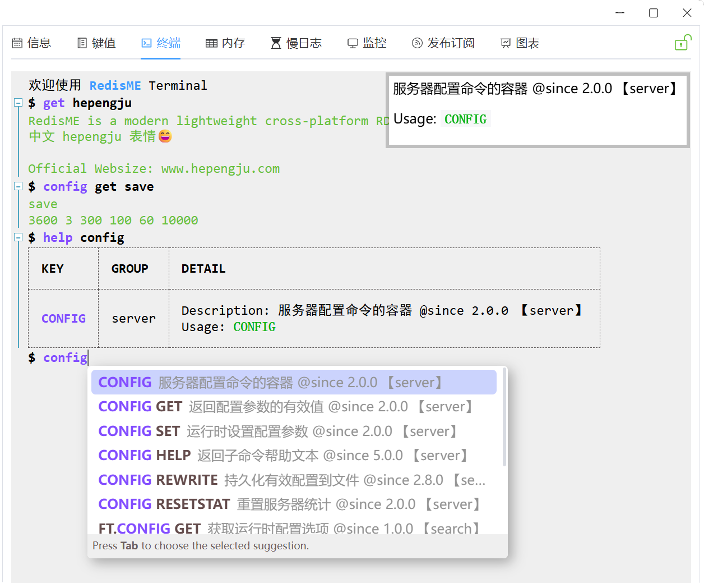
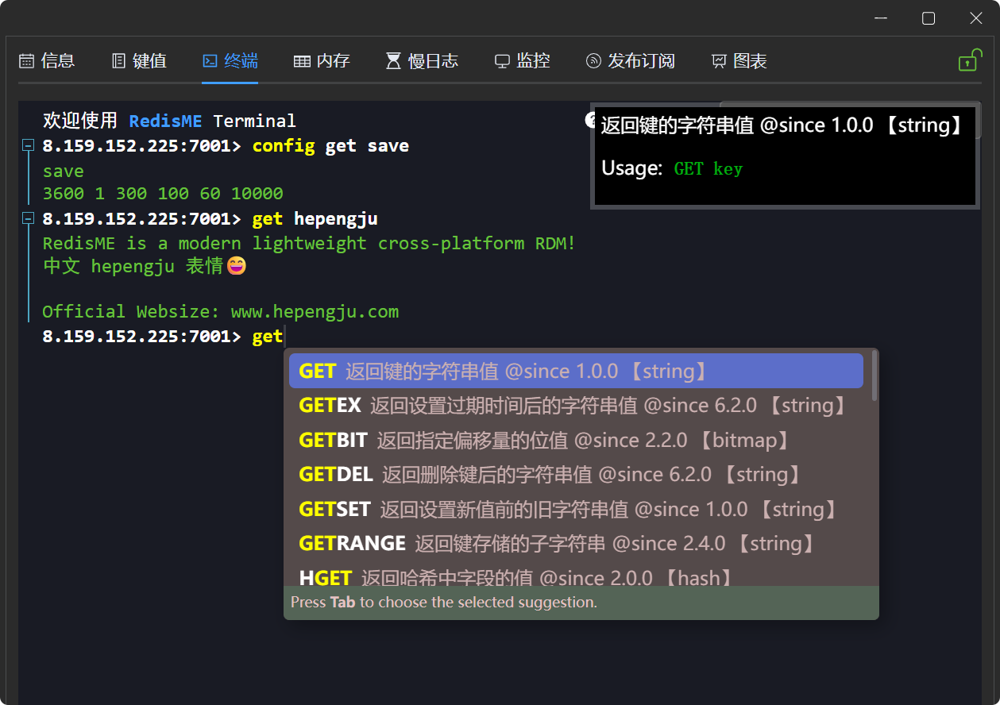
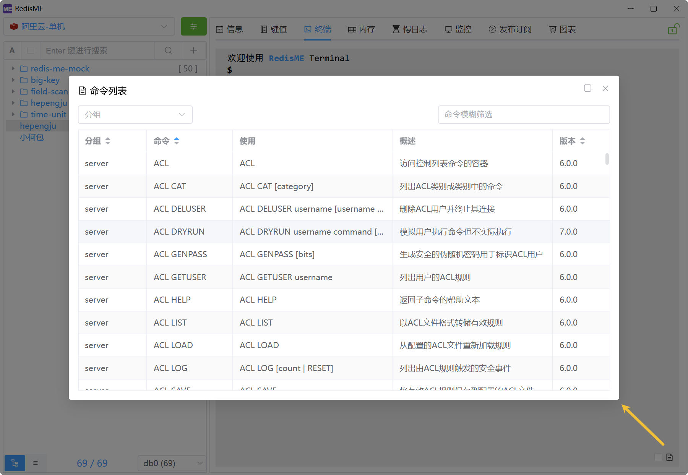
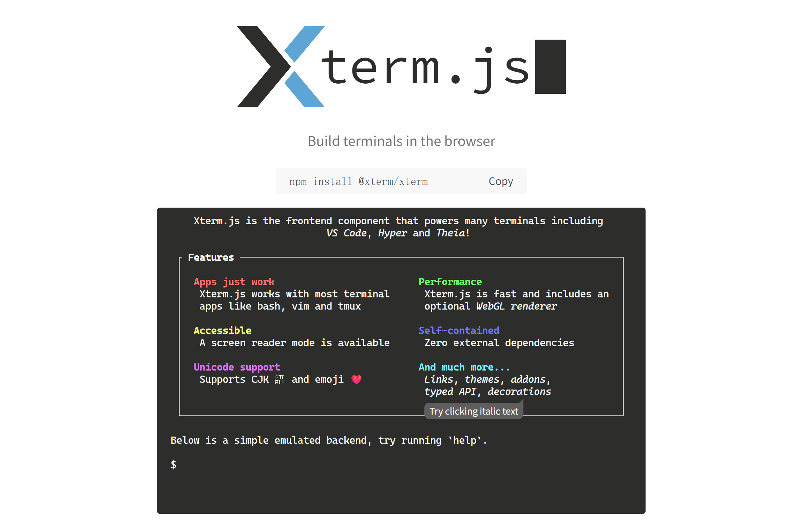
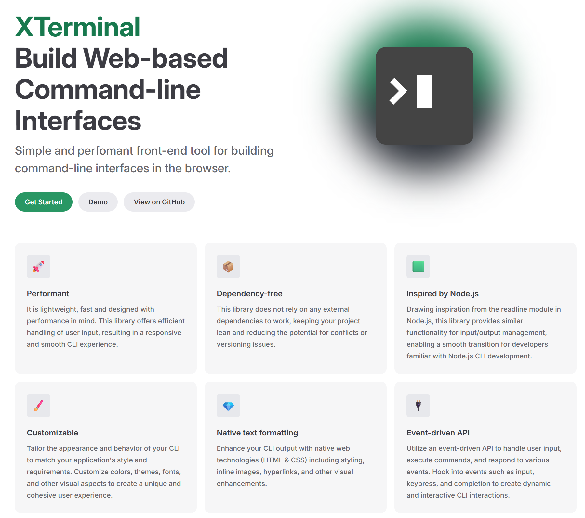
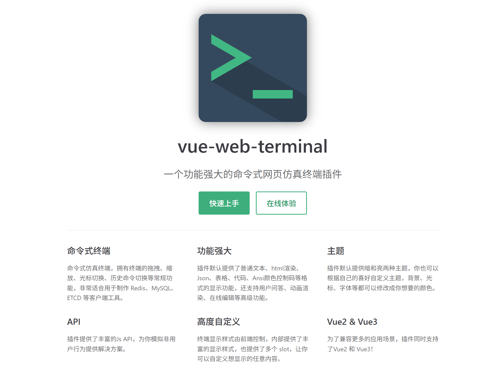

# 终端

[RedisME](https://www.hepengju.com) 界面支持大部分场景，但终端执行命令仍是不可或缺的

## 功能简述

- **执行回显**: 输入命令Enter执行
- **历史记录**: ↑ / ↓
- **提示补全**: 命令用法提示与Tab键补全
- **命令列表**: 点击图标查看命令的分组、语法、概述等
- **快捷键**: Ctrl + L/C/A/E 清屏/停止当前命令/光标到行首/行尾, F11全屏
- **扩展功能**: 命令折叠、选中复制、右键粘贴、结果自动复制等
- **内置命令**: clear 清屏, help 帮助, open 打开网址
- **集群模式**: 命令自动广播, 指定节点执行
  - 自动广播开启且没有选择节点时`CONFIG SET`和`SLOWLOG RESET`等命令会在所有节点执行
  - 正常情况下无需指定节点，仅在查看特定节点配置等特殊场景可手动指定节点

## 设计历史

RedisME的终端设计经历了3个完全重写的大阶段，目前已日益完善。
其中命令提示为了支持中英文及更好的性能，提前从[Redis官方仓库](https://raw.githubusercontent.com/redis/redis-doc/refs/heads/master/commands.json)
下载并预处理后内置在程序中。

## 1. 基于 [Xterm.js](https://xtermjs.org) (v0.1 ~ v1.2)

Xterm.js 可以在浏览器中实现完整的终端功能，被广泛用于Web端的SSH客户端、在线IDE、命令行工具等场景。
在项目中使用过比较熟悉，且[TinyRDM](https://redis.tinycraft.cc)也是使用Xterm.js实现的，因此最初采用此方案。
快捷键、历史记录等都需要手动实现，相对还比较简单。
**输入命令包含中文时的光标移动与退格一半字符问题，以及输入命令长度超过一行时的退格等处理非常麻烦。**
因此Xterm.js适合所有字符通过websocket全部转发到后端处理的场景，并不适合当前需求。

## 2. 基于 [Xterminal](https://xterminal.js.org) (v1.3 ~ v1.8)

XTerminal 简单且高性能的前端工具，用于在浏览器中构建命令行界面。
对于输入命令后执行并显示结果的场景非常适合，历史记录已内置支持，仅需手动添加快捷键即可，基本满足需求。
**命令帮助手册的显示以及输入提示需要手动实现，工作量比较大。**

## 3. 基于 [vue-web-terminal](https://tzfun.github.io/vue-web-terminal/zh) (v1.9 ~ latest)

vue-web-terminal 一个功能强大的命令式网页仿真终端插件。
命令式仿真终端，拥有终端的拖拽、缩放、光标切换、历史命令切换等常规功能，非常适合用于制作 Redis、MySQL、ETCD 等客户端工具。
**简单定制即满足需求，非常适合当前需求**。

