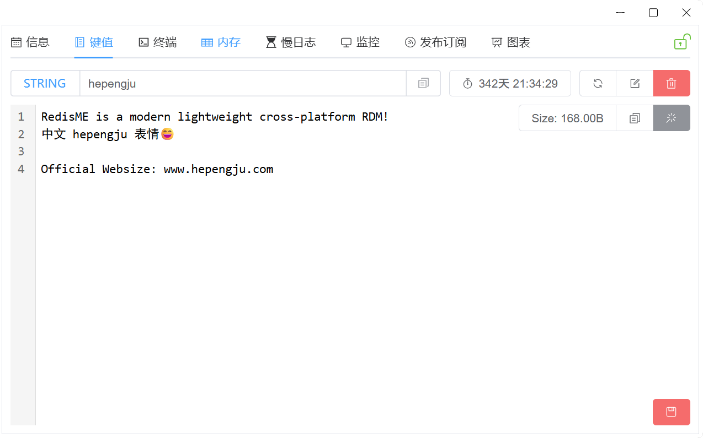
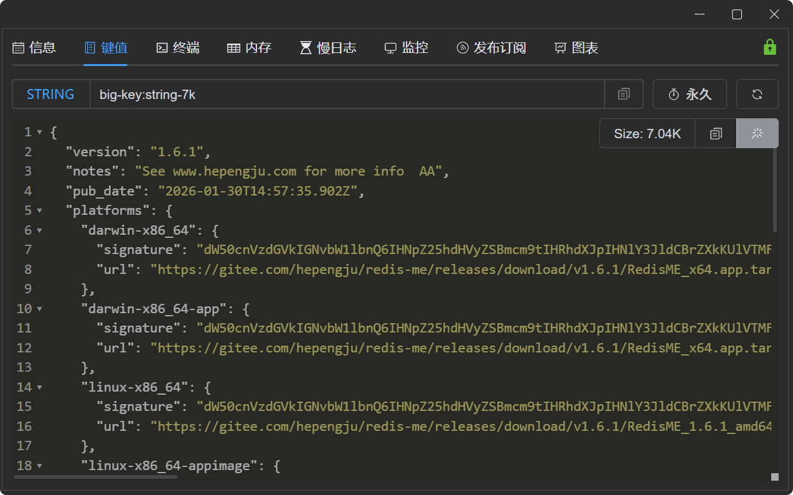
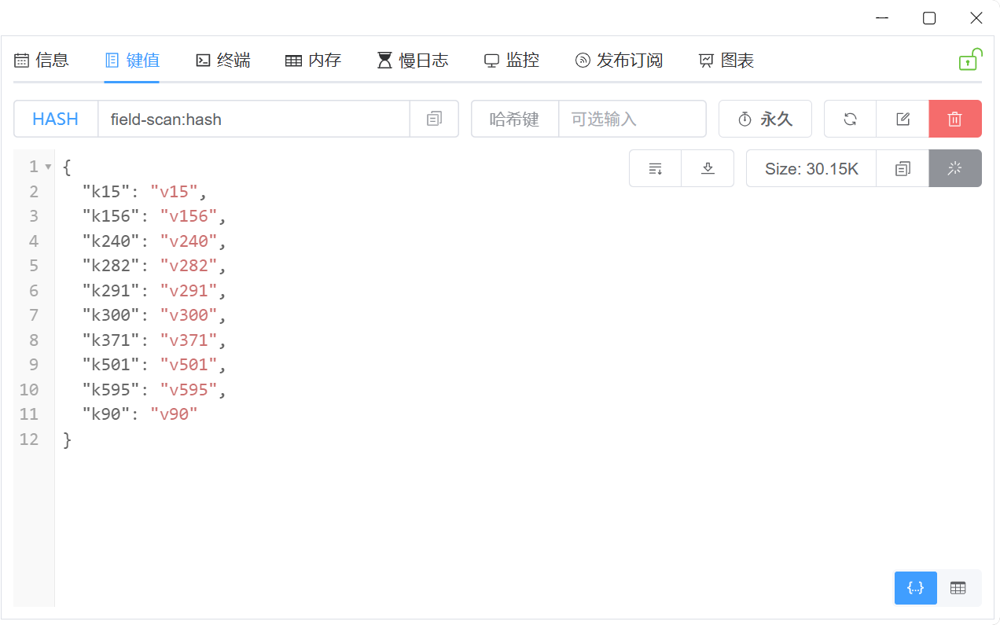
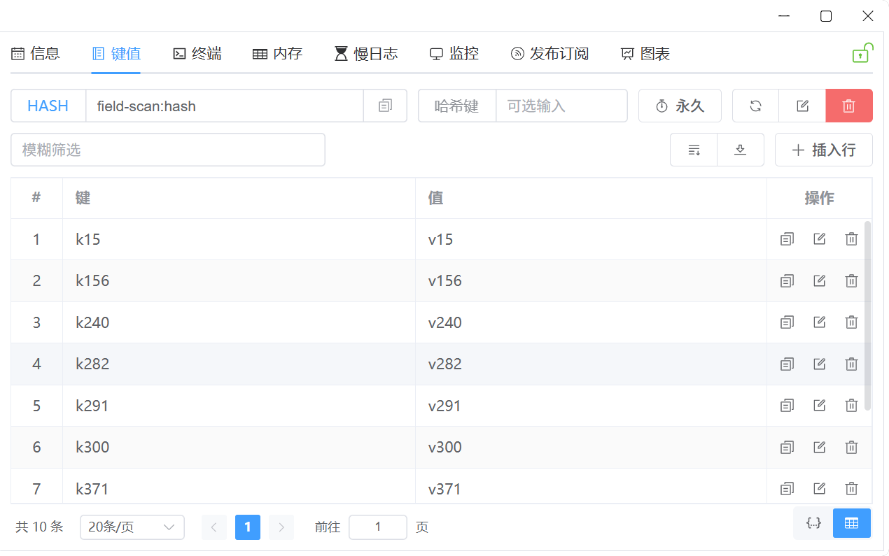

# 键值

[RedisME](https://www.hepengju.com) 键值显示针对实际场景进行深度定制优化

## 功能简述
- **只读可写**: 只读场景下增删改按钮隐藏，简化界面同时避免误操作
- **键值操作**: 键有效期、重命名键、删除键、复制键值、保存值等完善功能
- **美化显示**: 字符串为json格式 或 hash/set等结构，默认json美化显示
- **扫描支持**: 针对hash/set等结构，支持scan命令扫描获取，避免卡顿
- **键值大小**: 使用memory usage命令获取键及其值的内存使用量
- **可选哈希键**: 支持输入hash键，仅获取hash值
- **JSON/Table**: hash/set等默认显示为json，可切换为表格展示进行增删改

