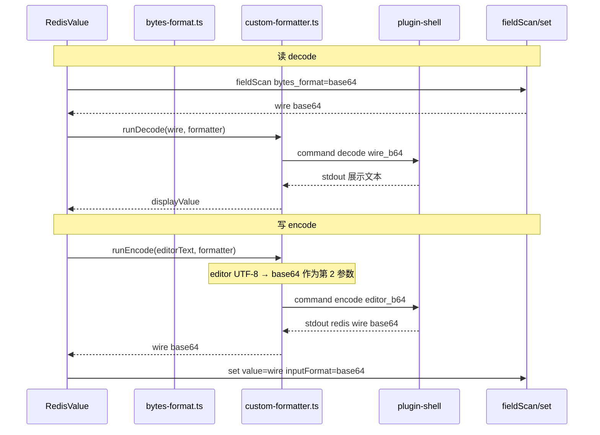

# 自定义编解码（Custom Formatter）方案

## 背景

3.6.0 规划「值支持自定义编解码实现」。用户可通过配置外部脚本，对 Redis **STRING** 值做自定义序列化/反序列化查看与编辑。

### 已落地前提（wire / view 分层）

后端 [`BytesFormat`](../src-tauri/src/utils/model.rs) **仅两种 IPC wire**：

| Wire     | 含义              |
| -------- | ----------------- |
| `utf8`   | UTF-8 lossy 文本  |
| `base64` | 原始字节的 Base64 |

hex / binary / msgpack 等**视图格式**已全部在前端 [`bytes-format.ts`](../src/utils/bytes-format.ts) 处理；`fieldScan` / `set` 通过 `toWireFormat(view)` 在 utf8 与 base64 间切换。

本方案在此之上叠加 **custom 视图**，**不改动** `client_trait` 与 `BytesFormat` 枚举。

---

## 设计目标

| 项        | 决策                                                                                   |
| --------- | -------------------------------------------------------------------------------------- |
| 首期类型  | **仅 STRING**（与 MsgPack 相同：`disabled: !stringType`，`viewFmtForField` 降级 utf8） |
| UI        | **单下拉**，与 MsgPack 并列在 EXT 区，不新增第二个下拉                                 |
| 读写      | **双向**（decode + encode）                                                            |
| exec 位置 | **前端** `@tauri-apps/plugin-shell`                                                    |
| 后端改动  | **最小**：仅注册 shell 插件 + capabilities（3 处）                                     |
| 脚本协议  | **两个参数**：`模式` + `base64 字符串`（见下文）                                       |

---

## 脚本协议（Base64 管道）

与后端 wire 格式对齐：**解码输入、编码输出均使用 Base64**。

### 调用方式

前端统一构造命令（用户只配置可执行入口）：

```bash
# 读：Redis 原始字节（已是 wire base64）→ 展示文本
{command} decode {redis_wire_base64}

# 写：编辑区文本 → UTF-8 字节再 Base64 → Redis 原始字节 base64
{command} encode {editor_text_base64}
```

| 方向       | 第 1 参数 | 第 2 参数（Base64）                              | stdout                                                              |
| ---------- | --------- | ------------------------------------------------ | ------------------------------------------------------------------- |
| **decode** | `decode`  | Redis 原始字节的 base64（来自 `fieldScan` wire） | **UTF-8 展示文本**（写入编辑器）                                    |
| **encode** | `encode`  | 用户编辑内容的 UTF-8 字节 base64                 | **Redis 原始字节的 base64**（trim 后直接 `set inputFormat=base64`） |

### 脚本约定

1. **参数 1**：固定字面量 `decode` 或 `encode`（大小写由脚本自行约定，前端传小写）
2. **参数 2**：单行 base64 字符串（不含换行）；**必须用引号包裹**（见下节「Shell 与 Base64」）
3. **decode 成功**：stdout 输出可编辑展示文本
4. **encode 成功**：stdout **仅一行** base64（Redis 写入字节）；前端校验后原样提交 `set`
5. **失败处理**（见下节「错误提示」）— **不使用** TinyRDM 的 `[RDM-ERROR]` 约定

### 示例脚本（Python 伪代码）

```python
import sys, base64

mode, b64 = sys.argv[1], sys.argv[2]
raw = base64.b64decode(b64)

if mode == 'decode':
    # 例：自定义格式 → 可读 JSON 文本
    text = my_format_to_text(raw)
    print(text)
elif mode == 'encode':
    text = raw.decode('utf-8')
    out = my_text_to_format(text)
    print(base64.b64encode(out).decode('ascii'))
```

### Shell 与 Base64（`+` `/` `=` 转义）

**标准 Base64 字符集**：`A–Z` `a–z` `0–9` **`+`** **`/`** **`=`**（末尾 padding）。

其中 **`+` `/` `=` 在 shell 里若不加引号会出问题**：

| 字符 | 未加引号时的风险                                  |
| ---- | ------------------------------------------------- |
| `+`  | 在部分上下文可能被当作 glob/运算符                |
| `/`  | 可能被解析为路径分隔符                            |
| `=`  | 可能被解析为变量赋值（尤其参数形如 `xxx=yyy` 时） |

Base64 **不含**单引号 `'`，因此 **Unix 推荐用单引号包裹第 2 参数**：

```bash
python3 /path/codec.py decode 'SGVsbG8+World/Foo=='
```

前端 `custom-formatter.ts` 拼 `sh -c` 时建议：

1. **`command`**：按路径规则单独引用（含空格时必须引号）
2. **`decode` / `encode`**：字面量，无需转义
3. **`b64` 参数**：`shellQuoteSingle(b64)` → 包一层 `'...'`（内部无 `'`，安全）
4. 整体再作为 `exec-sh` 的 `-c` 参数字符串；**禁止**把 base64 裸传给 shell

**Windows `cmd /C`**：第 2 参数用双引号 `"..."` 包裹；Base64 不含 `"` `\` `%`，一般安全。路径含空格时外层再套引号。

**实现注意：**

- 脚本侧应用 `sys.argv[2]` / `$2` 取参，**不要**依赖 shell 再拆词
- 超长 base64（命令行长度限制）：Phase 2 可改为 **stdin 传 b64** 或 **临时文件**（仅路径进 argv，与 ARDM `{HEX_FILE}` 同理）；首期 STRING 一般够用

**校验：** encode 返回的 stdout 在 trim 后应匹配 `/^[A-Za-z0-9+/]+=*$/`，再提交 `set`。

### 错误提示（替代 `[RDM-ERROR]`）

脚本失败时按优先级由前端组装**可读中文/英文提示**（i18n），不依赖 stdout 里的 magic string。

| 优先级 | 条件                                  | 用户看到的提示（示例）                                                       |
| ------ | ------------------------------------- | ---------------------------------------------------------------------------- |
| 1      | `stderr` 非空                         | 直接展示 stderr 首行/全文（脚本应写人话，如 `无法解析：无效的 pickle 数据`） |
| 2      | exit code ≠ 0，stderr 为空            | `自定义格式「{name}」执行失败（退出码 {code}）`                              |
| 3      | exit 0 但 decode stdout 为空          | `解码结果为空，请检查脚本 decode 分支`                                       |
| 4      | exit 0 但 encode stdout 非合法 base64 | `编码结果不是有效的 Base64，请检查脚本 encode 分支`                          |
| 5      | 超时                                  | `自定义格式「{name}」执行超时（{n}s）`                                       |

**脚本作者约定：**

- **成功**：仅向 stdout 写结果；exit 0
- **失败**：向 **stderr** 写简短说明 + **exit 非 0**（推荐 `sys.exit(1)`）；stdout 可不输出或留空
- **不要**在 stdout 输出 `[RDM-ERROR]` 等占位符 — 用户应在 stderr 看到具体原因

**前端 `custom-formatter.ts`：**

```ts
function formatExecError(name: string, result: { code; stderr; stdout }): string {
  const err = result.stderr?.trim()
  if (err) return err
  if (result.code !== 0) return t('customCodec.execFailed', { name, code: result.code })
  return t('customCodec.invalidOutput', { name })
}
```

Setting 页「测试解码/编码」同样使用该逻辑，便于用户调试脚本。

### 与 MsgPack 的对应关系

|      | MsgPack                 | Custom                            |
| ---- | ----------------------- | --------------------------------- |
| 实现 | 前端 `@msgpack/msgpack` | 外部脚本 + shell                  |
| wire | base64                  | base64                            |
| 展示 | JSON 文本               | 脚本 stdout 文本                  |
| 保存 | JSON → msgpack base64   | 文本 base64 → 脚本 → redis base64 |

---

## 架构



**原则：**

- Redis 读写仍只认识 utf8 / base64 wire，custom 不进入 Rust
- custom 视图时 `toWireFormat('custom:x')` → **`base64`**（与 hex/msgpack 一致）
- 配置存前端 `settings.customCodecs`，**无需** `sync` 到 Rust

---

## 前端 exec（tauri-plugin-shell）

Tauri WebView 无 Node `child_process`，使用官方 [shell 插件](https://v2.tauri.app/plugin/shell/)。

用户 `command` 路径无法逐条写入 capabilities，采用 **shell 包装**：

```json
{
  "identifier": "shell:allow-execute",
  "allow": [
    { "name": "exec-sh", "cmd": "sh", "args": ["-c", { "validator": ".*" }] },
    { "name": "exec-cmd", "cmd": "cmd", "args": ["/C", { "validator": ".*" }] }
  ]
}
```

Unix: `Command.create('exec-sh', ['-c', fullCommand])`  
Windows: `Command.create('exec-cmd', ['/C', fullCommand])`

`fullCommand` 示例：

```text
"/usr/bin/python3" "/path/to/my_codec.py" decode "SGVsbG8="
```

信任模型：命令由用户在设置中配置（同 AnotherRDM）。

---

## 配置结构

```ts
/** 持久化于 settings.customCodecs */
interface CustomCodec {
  name: string // 下拉显示名，value 为 custom:{name}
  command: string // 可执行入口，如 python3 /path/to/codec.py 或 /path/to/codec.sh
}
```

**不再使用** `decodeParams` / `encodeParams` / `{HEX}` 模板；模式与 base64 由前端固定追加为第 1、第 2 参数。

可选扩展（非首期）：`argsPrefix: string[]` 供脚本需要额外 flag 时使用。

---

## 模块与文件

### 后端（3 处）

| 文件                                  | 改动                                  |
| ------------------------------------- | ------------------------------------- |
| `src-tauri/Cargo.toml`                | `tauri-plugin-shell = "2"`            |
| `package.json`                        | `@tauri-apps/plugin-shell`            |
| `src-tauri/src/lib.rs`                | `.plugin(tauri_plugin_shell::init())` |
| `src-tauri/capabilities/default.json` | `shell:allow-execute`（见上）         |

**不改：** `model.rs`、`util.rs`、`client_trait.rs`、Specta 命令。

### 前端

| 文件                                     | 职责                                                                                                       |
| ---------------------------------------- | ---------------------------------------------------------------------------------------------------------- |
| **新建** `src/utils/custom-formatter.ts` | `runDecode` / `runEncode`、拼 shell 命令、引号转义、超时（默认 30s）                                       |
| `src/utils/bytes-format.ts`              | `isCustomView`、`isStringOnlyView`、扩展 `viewFmtForField`；`meFormatViewValueAsync` / `meViewToWireAsync` |
| `src/plugins/tauri.ts`                   | `customCodecs: []` 默认值 + 持久化 + 旧键迁移                                                              |
| `src/views/ext/CustomCodec.vue`          | 自定义编解码 CRUD + 测试 decode/encode（编解码下拉入口）                                                   |
| `src/views/tab/RedisValue.vue`           | `formatOptions` 追加 custom；`displayValue` async；`setValue` encode                                       |

### bytes-format.ts 辅助逻辑

```ts
export type ViewBytesFormat = 'utf8' | 'hex' | 'binary' | 'base64' | 'msgpack' | `custom:${string}`

export function isCustomView(view: ViewBytesFormat): view is `custom:${string}` {
  return view.startsWith('custom:')
}

export function isStringOnlyView(view: ViewBytesFormat): boolean {
  return view === 'msgpack' || isCustomView(view)
}

export function viewFmtForField(view: ViewBytesFormat): ViewBytesFormat {
  return isStringOnlyView(view) ? 'utf8' : view
}
```

### RedisValue.vue 要点

- `formatOptions`：EXT 区 = MsgPack + `settings.customCodecs`（`disabled: !stringType`）
- 切换至非 String 键：若当前为 msgpack/custom，重置 `bytesFormat = 'utf8'`
- `displayValue` ref + `watch` → custom 时 `runDecode(wire, formatter)`
- `setValue`：custom 时 `wire = await runEncode(editorText, formatter)`，再 `set({ inputFormat: 'base64' })`
- 切换 format：`@change="refreshKey"`（首期保持简单；base64 wire 下切换 custom↔hex 可后续优化为免 re-fetch）

### FieldSet / FieldAdd

首期**不**支持 custom（与 MsgPack 相同，`viewFmtForField` 降级 utf8）。后续 Phase 2 再扩展。

---

## 分阶段交付

### Phase 1（3.6.0 MVP）

- shell 插件 + capabilities
- `custom-formatter.ts` + Setting CRUD
- RedisValue STRING 读写
- 文档：脚本协议 + Python 样例

### Phase 2

- Hash/List/Set/ZSet 编辑弹窗
- 模板变量 `{KEY}` `{FIELD}` 等（若仍需要，作为第 3 参数扩展，不破坏两参数核心协议）
- format 切换免 re-fetch（wire 已为 base64 时）

### Phase 3

- 内置 Pickle/PHP 等**预置 formatter 模板**（一键导入 command 配置）
- autoFormat 自动检测

---

## 改动清单（Phase 1）

| 区域     | 文件                             | 约行数 |
| -------- | -------------------------------- | ------ |
| 后端配置 | Cargo.toml, lib.rs, capabilities | ~15    |
| 前端新建 | custom-formatter.ts              | ~80    |
| 前端扩展 | bytes-format.ts                  | ~30    |
| 前端 UI  | CustomCodec.vue, RedisValue.vue  | ~120   |
| 前端配置 | plugins/tauri.ts, locales        | ~20    |
| **合计** | ~8 文件                          | ~225   |

---

## 验证计划

- [ ] String：配置 Python 脚本，decode 展示、encode 保存后再读一致
- [ ] encode stdout 非合法 base64 → 错误提示，不写 Redis
- [ ] 非 String 键：custom 项 disabled
- [ ] FieldSet：父级选 custom 时弹窗仍为 utf8
- [ ] MsgPack / hex / utf8 行为回归
- [ ] Windows `cmd /C`、Linux/macOS `sh -c` 均可执行
- [ ] 参数含特殊字符时引号转义正确

---

## 决策记录

1. **Base64 管道**：decode 输入、encode 输出均为 base64，与后端 wire 一致，脚本接口统一为两参数。
2. **decode 输出 / encode 输入**：decode stdout 为展示文本；encode 第 2 参数为编辑区 UTF-8 的 base64（非 redis wire）。
3. **前端 shell exec**：后端零业务代码；capabilities 用 exec-sh/exec-cmd 包装。
4. **首期仅 STRING**：与 MsgPack 约束一致，实现量最小。
5. **单下拉**：custom 项与 MsgPack 同在 EXT 区，不新增 UI 控件。
