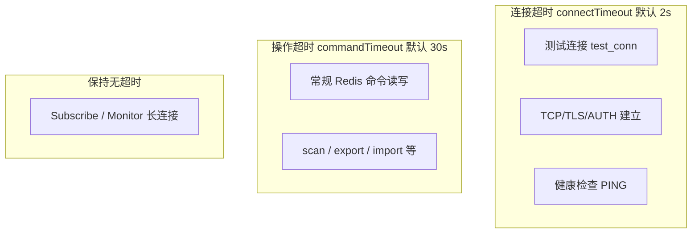
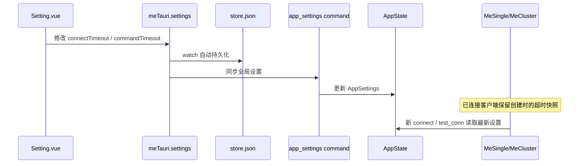

# 全局超时设置 - 实现方案

> 状态：待实现（2026-05-23 初步方案）

## 一、需求

在应用设置层统一配置 Redis 客户端超时，**不做逐连接配置**：

| 设置项   | 默认值 | 含义                              |
| -------- | ------ | --------------------------------- |
| 连接超时 | 2s     | 建立连接、测试连接、健康检查 PING |
| 操作超时 | 30s    | 已建立连接上的单次命令读写        |

### 生效策略（已确认）

**仅对新连接/重连生效**：修改设置后不清空已缓存客户端；`MeSingle`/`MeCluster` 在 `init` 时快照超时值，手动断开后重连才使用新配置。`test_conn` 始终读当前 `AppState` 最新值。

---

## 二、现状

超时目前全部硬编码于 `src-tauri/src/utils/util.rs`：

| 常量                        | 值  | 实际用途                                   |
| --------------------------- | --- | ------------------------------------------ |
| `CONNECTION_CHECK_TIMEOUT`  | 2s  | 测试连接、健康检查 PING                    |
| `CONNECTION_NORMAL_TIMEOUT` | 30s | 已建立连接的读写超时                       |
| `CONNECTION_CHECK_SECONDS`  | 30s | 健康检查间隔（内部逻辑，**不暴露给用户**） |

使用点：

- `src-tauri/src/utils/conn.rs` — 测试连接
- `src-tauri/src/client/impl_single.rs` — `new_conn` / `check_connection_timeout` / `get_new_conn`
- `src-tauri/src/client/impl_cluster.rs` — 同上

应用设置仅在前端 `src/plugins/tauri.ts` 定义与持久化，Rust 侧**尚无** settings 同步机制（对比：连接列表通过 `conn_list` 命令同步）。

---

## 三、语义定义



- **连接超时**：建立连接 + 快速探测的上限。
- **操作超时**：连接建立后，单次 Redis 命令读写的上限。
- **不纳入用户配置**：健康检查间隔（30s）、Mutex 锁等待（10s）、SSH 认证（10s）、Subscribe/Monitor 长连接。

---

## 四、架构：settings 同步到 AppState（仿 conn_list）



---

## 五、后端改动

### 5.1 新增 `AppSettings` 类型

在 `src-tauri/src/utils/model.rs` 增加（`specta::Type` 导出给前端）：

```rust
api_model!(AppSettings {
    connect_timeout_secs: u64,  // 默认 2
    command_timeout_secs: u64,    // 默认 30
});
```

`Default` 与现有常量保持一致；`app_settings` 接收参数时做 clamp（建议：连接 1–30s，操作 5–300s）。

### 5.2 扩展 `AppState`

`src-tauri/src/client/state.rs`：

```rust
pub struct AppState {
    pub connections: Mutex<HashMap<String, ConnConfig>>,
    pub clients: RwLock<HashMap<String, Arc<Box<dyn MeClient>>>>,
    pub app_settings: RwLock<AppSettings>,  // 新增
}
```

新增 Tauri 命令 `app_settings(app_settings: AppSettings)`（注册于 `lib.rs` / `api.rs`），仅更新 `AppState`，**不**断开已有客户端。

### 5.3 超时注入点

**连接建立** — `conn.rs`：

- `get_client_single(conf, connect_timeout)`：`get_connection_with_timeout(connect_timeout)`
- `get_client_cluster(conf, connect_timeout)`：builder 设 `connection_timeout`，测试 PING 同理

**客户端实例** — `MeSingle` / `MeCluster` 增加字段：

```rust
connect_timeout: Duration,
command_timeout: Duration,
```

在 `init` 时从 `AppSettings` 快照；`new_conn` / `check_connection_timeout` / `get_new_conn` 改用实例字段，不再引用全局常量。

**需传入 AppHandle / AppSettings 的入口**：

| 入口                 | 改动                                                            |
| -------------------- | --------------------------------------------------------------- |
| `AppHandle::connect` | 读 `AppState.app_settings` 传给 `init`                          |
| `test_conn`          | 增加 `app_handle` 参数，读最新 settings 传给 `ConnConfig::test` |
| `masters`            | 同上（探测主节点也应受连接超时约束）                            |

**顺带修正（小范围、与「连接超时」语义一致）**：

- 单机 `new_conn` 现用 `get_connection()`（TCP 无超时）→ 改为 `get_connection_with_timeout(connect_timeout)`
- 集群 runtime `ClusterClient` builder 现用默认 1s → 改为用户配置的 `connect_timeout`

**保持不变**：

- Subscribe / Monitor 专用连接不设读写超时
- `CONNECTION_CHECK_SECONDS`、Mutex 10s、SSH 10s 维持硬编码

### 5.4 移除/降级硬编码常量

`util.rs` 中 `CONNECTION_CHECK_TIMEOUT` / `CONNECTION_NORMAL_TIMEOUT` 可改为 `AppSettings::default()` 的辅助函数，或仅保留为默认值来源，避免散落 magic number。

---

## 六、前端改动

### 6.1 设置字段

`src/plugins/tauri.ts` `initSettings` 增加：

```ts
connectTimeout: 2,   // 秒
commandTimeout: 30,  // 秒
```

`src/types/vite-env.d.ts` 补充类型。

启动时与 settings 变更时调用 `meCommands.appSettings(...)`（可放在现有 `watch(meTauri, ...)` 中，与持久化并列，确保 TabConn 无连接时也能同步）。

### 6.2 设置 UI

`src/views/ext/Setting.vue`「更多设置」卡片，在扫描数量旁增加两个 `el-input-number`：

- 连接超时（1–30，默认 2），tooltip：测试连接、建立连接、健康检查
- 操作超时（5–300，默认 30），tooltip：常规命令读写

纳入 `moreDefaultSettings` / `isMoreDiff` / `toDefault('moreSetting')`。

### 6.3 i18n

`src/locales/lang/zh-cn.ts`、`en.ts` 增加 label 与 tip。

### 6.4 类型绑定

运行/导出 specta 更新 `src/types/tauri-specta.ts`（`AppSettings` + `appSettings` 命令）。

---

## 七、边界与说明

1. **与 Redis 服务器 `timeout` 配置无关**：`RedisTauri.vue` 里的 `config set timeout` 是服务端空闲断开策略，与本方案客户端超时独立。
2. **修改设置后提示（可选）**：可在 Setting 的 tooltip 中注明「对已连接会话在重新连接后生效」，无需弹窗。
3. **旧 store 兼容**：缺失字段走 `initSettings` 默认值，与 `fieldShow` 等现有迁移逻辑一致。
4. **测试**：Rust 侧可对 `AppSettings` clamp 与 `new_conn` 超时设置补单元测试；手动验证：改连接超时后测试不可达主机、`test_conn` 快速失败；改操作超时后对慢命令行为变化。

---

## 八、涉及文件清单

| 层             | 文件                                                                                    |
| -------------- | --------------------------------------------------------------------------------------- |
| Rust 类型/命令 | `utils/model.rs`, `api.rs`, `lib.rs`                                                    |
| Rust 状态      | `client/state.rs`                                                                       |
| Rust 连接      | `utils/conn.rs`, `client/impl_single.rs`, `client/impl_cluster.rs`, `utils/util.rs`     |
| 前端           | `plugins/tauri.ts`, `types/vite-env.d.ts`, `views/ext/Setting.vue`, `locales/lang/*.ts` |
| 生成           | `types/tauri-specta.ts`                                                                 |

改动面可控：不扩展 `ConnConfig`，不逐命令传参；相比 `keyScanCount` 每次 scan 传参，这是**一次性全局同步 + 连接建立时读取**，复杂度更低。

---

## 九、实现清单

- [ ] 新增 `AppSettings` 类型、`AppState` 字段、`app_settings` Tauri 命令及默认值/clamp
- [ ] `conn.rs` / `impl_single` / `impl_cluster` 用 `AppSettings` 替换硬编码超时，`MeSingle`/`MeCluster` 快照超时
- [ ] `connect` / `test_conn` / `masters` 读取 `AppState` 最新 settings 并传入
- [ ] `tauri.ts` 默认值、类型定义、启动与 watch 同步 `app_settings`
- [ ] `Setting.vue` 增加两项超时输入、恢复默认与 i18n
- [ ] 运行 `vp check` / 相关测试，手动验证 `test_conn` 与重连后超时生效
