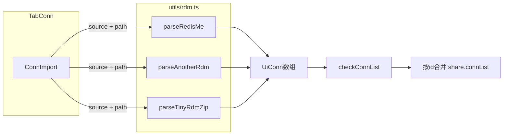

# RDM 连接导入

从 RedisME、AnotherRDM、TinyRDM 导出文件导入连接；解析与映射集中在 [`src/utils/rdm.ts`](../src/utils/rdm.ts)（后续更多 RDM 在同一文件扩展）。

## plans 目录命名规范（复核）

与现有方案文档对齐：

| 规则                                                                                                                    | 示例                                                  |
| ----------------------------------------------------------------------------------------------------------------------- | ----------------------------------------------------- |
| 文件名：**小写英文 + 连字符（kebab-case）**                                                                             | `command-export-format.md`、`redis-acl-management.md` |
| 文件名体现**主题域 + 功能/对象**，简短可读                                                                              | `value-display-format.md`、`command-logging.md`       |
| **阶段性审计/对标**类可加日期后缀                                                                                       | `project-deep-audit-2026-04-25.md`                    |
| 正文：**普通 Markdown**；仓库内方案**不使用** Cursor 计划专用的 YAML frontmatter（与 `redis-acl-management.md` 等一致） |
| 实现跟踪：文末用 **Markdown 任务列表** 即可                                                                             | 见下方「实现清单」                                    |

本文件命名 **`rdm-import.md`**：与 `rdm.ts` 工具模块对应，且比 `connection-import-from-multiple-rdm-sources.md` 更短。

---

## 现状

- 导入逻辑在 [`src/views/TabConn.vue`](../src/views/TabConn.vue)：`importConn()` 调 Tauri `open`（仅 `json`）→ `readTextFile` → `checkImportContent`（`meJsonParse` + 字段校验）→ 按导入项 `id` 与现有列表合并。
- [`src/components/MeFileInput.vue`](../src/components/MeFileInput.vue)：已支持单个 `fileSuffix`。用户先选来源再选文件：**RedisME → `json`，AnotherRDM → `ano`，TinyRDM → `zip`**，弹窗内 `:file-suffix` 随来源切换；**切换来源时清空已选路径**。

## 外部格式结论

| 来源           | 文件    | 内容                                                                                                                                                                                                                                  |
| -------------- | ------- | ------------------------------------------------------------------------------------------------------------------------------------------------------------------------------------------------------------------------------------- |
| **AnotherRDM** | `.ano`  | 整文件为 **Base64(UTF-8 JSON 数组)**；数组元素含 `host`、`port`（可能为字符串）、`auth`、`username`、`name`/`connectionName`、`cluster`、`connectionReadOnly`、`color`、`key`，可选 `sshOptions` / `sslOptions` / `sentinelOptions`。 |
| **TinyRDM**    | `.zip`  | 内含 **`connections.yaml`**；YAML 根为数组，`type: "group"` 时含嵌套 `connections`，否则为单机配置；YAML 键为 snake_case。                                                                                                            |
| **RedisME**    | `.json` | 与当前导出一致（现有 `checkImportContent` 行为）。                                                                                                                                                                                    |

## 架构（数据流）

## 实现要点

### 1. MeFileInput 与文件类型

**不修改** `MeFileInput.vue`。在 `ConnImport` 中按来源绑定 `file-suffix`：`json` / `ano` / `zip`。

### 2. 新建 `src/utils/rdm.ts`

**命名**：各类 RDM 连接导入转换集中在此文件，避免碎片化。

- **RedisME**：从现有 `checkImportContent` 抽出「JSON → 校验 → `UiConn[]`」为纯函数，或复用相同校验逻辑。
- **AnotherRDM**：`trim` → Base64 → UTF-8 解码（`Uint8Array` + `TextDecoder`）→ `JSON.parse` → 映射到 `UiConn`：
  - `id`：`another-${item.key}`，缺 `key` 时用 `nanoid()`。
  - `name`、`host`、`port`（转 `number`、限制 `u16`）、`password`←`auth`、`username`、`cluster`、`readonly`←`connectionReadOnly`、`color`。
  - SSH / SSL / Sentinel 按字段映射到 `ConnConfig`（`privatekey`→`pkfile`；`nodePassword`→`sentinelOption.masterPassword` 等）。
  - `db`：无则 `0`。
- **TinyRDM**：`readFile` 读 zip → `fflate.unzipSync` → 查找 `connections.yaml` 或 `*/connections.yaml` → `yaml` 解析 → 递归展平 group → 映射到 `UiConn`。
  - **Unix 套接字**：后端仅 TCP 时跳过并提示。
  - `id`：建议 `tinyrdm-${name}` 等确定性前缀。

调用方对结果数组执行 [`checkConnList`](../src/plugins/tauri.ts)，再按 `id` 与 `share.connList` 合并。

### 3. UI

- 新增 [`src/views/ext/ConnImport.vue`](../src/views/ext/ConnImport.vue)（与 `ConnSave.vue` 并列）。
- [`TabConn.vue`](../src/views/TabConn.vue)：下拉「导入」改为打开对话框。

### 4. 依赖

`vp add yaml fflate`

### 5. i18n

[`zh-cn.ts`](../src/locales/lang/zh-cn.ts)、[`en.ts`](../src/locales/lang/en.ts) 的 `conn` 段：对话框标题、三来源、文件必填、各解析错误文案等。

### 6. 验证

手工验证 `.ano` / `.zip`；`vp check`、按需 `vp test`、`pnpm run check-locale-keys`。

## 风险与范围控制

- 证书/私钥路径跨机可能无效，属预期。
- `tauri-specta.ts` 若由工具链再生成，按仓库惯例处理差分。

---

## 实现清单

- [x] `vp add yaml fflate`（依赖：`fflate`、`yaml`）
- [x] 新增 `src/utils/rdm.ts`（RedisME / AnotherRDM / TinyRDM，预留扩展）
- [x] 新增 `ConnImport.vue`（MeFileInput 按来源 `fileSuffix`，切换来源清空路径）；`TabConn` 接入
- [x] 中英 `conn.*` 文案；`vp check` + `check-locale-keys`；Tauri `fs:allow-read-file`
